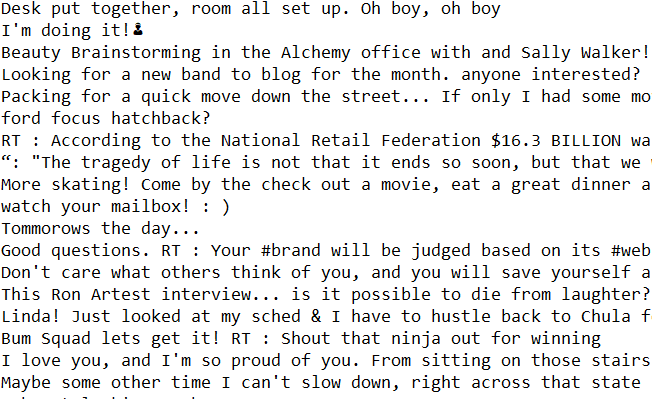

Capstone Presentation
========================================================
author: Ben Straub
date: March 23, 2018
autosize: true

***

Overview
========================================================

The Shiny App is avaiable [here](https://benstraub.shinyapps.io/capstone_text_prediction_app/).  Please check out if you haven't already!

- The App attempts to predict the next word in a sentence or phrase that you are typing.
- The App is similar to how smartphones do text prediction.

How to use the App
========================================================

### Steps for App use
1. Enter a word or words into the **"Enter Word Here"** textbox
2. **"NULL"** is displayed in the **"Next Word"** textbox.
3. Once text is entered into the **"Enter Word Here"**, the predictive model will provide your next word in the **"Next Word"** textbox.
4. Also provided is which n-gram look-up table was used to find your next word

The Data
========================================================

- Data is from twitter, blogs and news sites.
- Available from [Swiftkey](https://swiftkey.com/en)
- Snapshot of raw data to right shows challenges for PreProcessing
- Removed symbols, white space, punctuation, stopwords,
  emails, numbers, upper case and links.
- Created bi, tri and quad ingrams and saved as Rdata files
  for Predictive Model.

***

The Algorithm
========================================================

- Many algorithms are avaiable for Natural language processing, but since this was my first foray into NLP I decided to stick with the **"Backoff Algorithm"**.

**"Summary of Backoff Algorithm"**

- The ingrams contain the frequencies of each word or phrase.  
- Once a word or phrase is inputed, the Algorithm searches through the ingrams starting with 4 and goes down to 2.  
- Simple, but perfroms pretty well even with my naive implementation.

Future Work
========================================================

1.  The algorithm can not incorporate new data that the ngrams do not contain, i.e. no learning.
2.  The App could be more flashy and interactive.
3.  Even though the App can do some simple prediction, if I could include more data into the ngrams then I could increase the performance.

